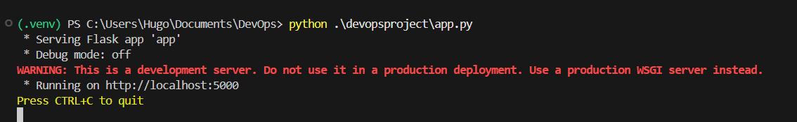
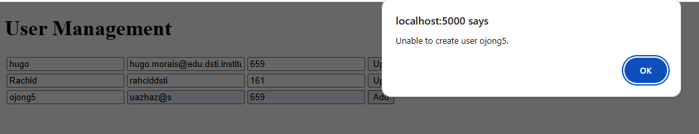
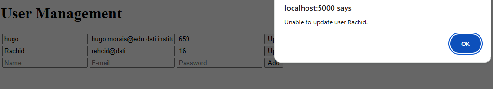
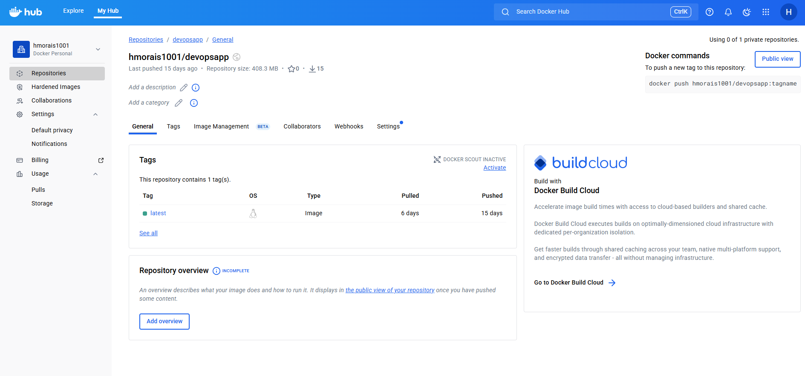
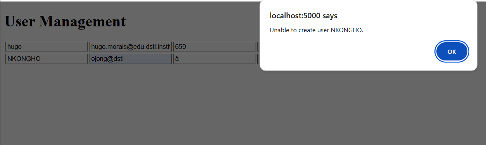
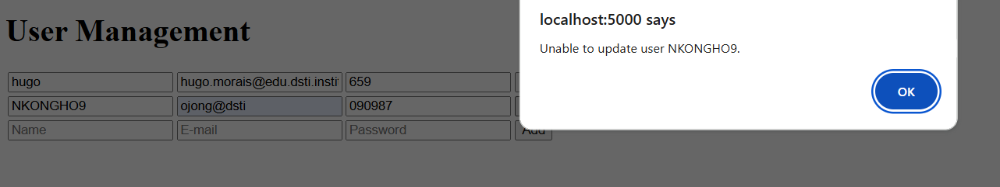
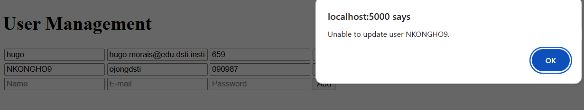
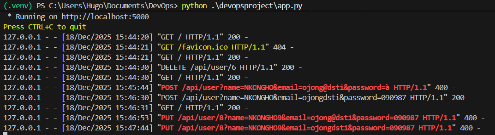
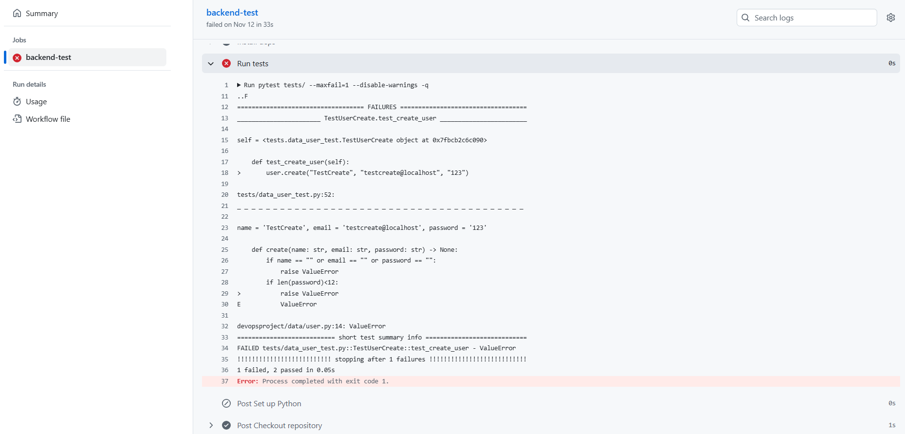

# DevOps Project — User API

## Overview

This project is a simple **RESTful User API** that allows:
- Adding users
- Modifying user information
- Deleting users

User data (email and password) is stored in a **MariaDB database**.

The project covers the full **DevOps lifecycle**, including:
- Application development
- Infrastructure as Code **(IaC)**
- Docker containerization
- Continuous Integration **(CI)**
- Container orchestration using **Kubernetes**

---

## 1. Work Performed

### Application :
- Development of a **User API** (CRUD operations: create, read, update, delete)
- User data persistence using **MariaDB**
- **Unit and functional tests** to validate differentes cases

### CI/CD :
- **GitHub Actions pipeline**
  - Automated tests to protect the integrity of the `main` branch
  - Pipeline triggered on push and pull requests

### IaC :
- **Oj rajoute ce que tu as fait !!!!!!!!!!!!!!!!!!!!!!!!!!**


### Containerization

- Creation of a **Docker image** for the User API using a Dockerfile
- The image can be used to run the application locally in a consistent environment
- The image is published to **Docker Hub** for easy distribution

### Kubernetes :
- **Rachid rajoute ce que tu as fait !!!!!!!!!!!!!!!!!!!!!!!!!!!!!!!!!**

---

## 2. Screenshots

Screenshots are available in the `./screenshots` folder.

They include:
- API running and responding to requests
- Docker build and run commands    
- Docker Hub repository
- GitHub Actions CI/CD pipeline
- Kubernetes resources and dashboard *(if applicable)*  RACHID !!!

Example:
```md

## Screenshots

### Flask Application Running Locally

This screenshot shows the Flask application running locally using the development server.



---

### Graphical User Interface – User API

This screenshot shows the main graphical interface used to interact with the User API.


---

### Graphical Interface – Create User

This screenshot illustrates the creation of a new user through the graphical interface.



---

### Graphical Interface – Update User

This screenshot illustrates the update of an existing user through the graphical interface.



---

### Docker Hub – Published Image

This screenshot shows the Docker image published on Docker Hub.



---

### Local MariaDB Container

This screenshot shows a MariaDB container running locally for development and testing purposes.


## Error Handling & Validation

The following screenshots demonstrate how the application and the DevOps workflow handle error scenarios, validation rules, and rejected changes.

### Invalid password during user creation


### Invalid name during user update


### Invalid email during user update


### Flask server error logs


### GitHub Pull Request – Unmerged Unit Test


### GitHub Actions – Failed Merge / Validation

